# 개념은 중요치 않음, 구현을 할 수 있는가가 중요하다


# 후위표기법 (결과 똑같이 나오나 확인)

* 후위표기법은 중위에서 후위로 / 후위에서 계산하고 결과하는 두가지로 나눠진다.

* 숫자면 바로 결과로 가고, 숫자가 아닌 것들은 stack에 !

  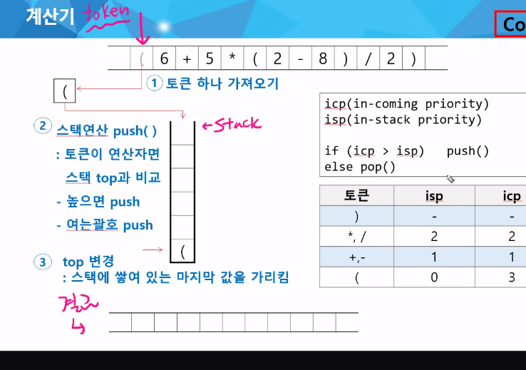

* 들어올 토큰과 이미 탑에 존재하는 토큰과 비교, 더 클때만 넣음

* 닫는 괄호가 icp일때, 여는괄호 만날때까지 팝해서 결과에 넣어줌

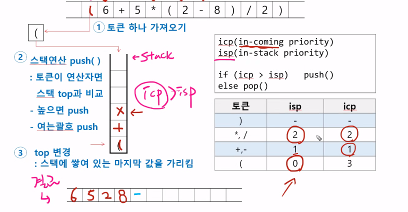

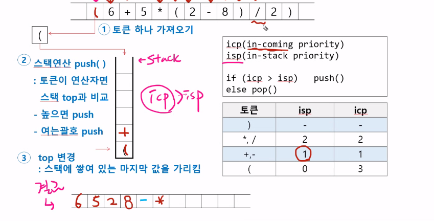

/랑 *랑 같으니까 같으면 *를 뱉어줘야함


## 연습문제1 -> 할수있으면 좋음, 못해도 괜찮음 (시뮬레이션 알고리즘 유형)

icp이 사실 가장 중요해서, 

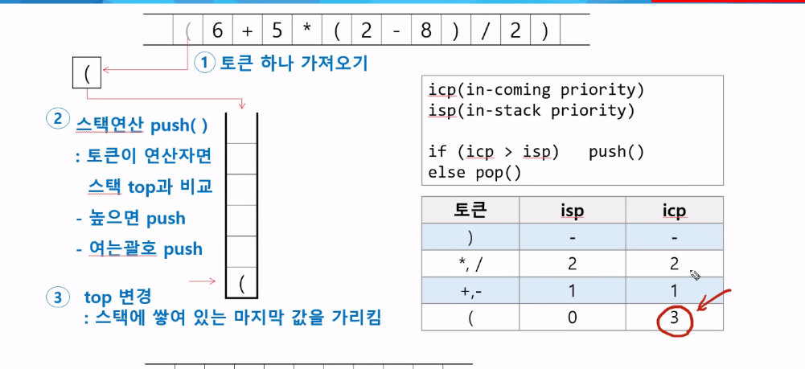

큰것 부터 처리한다

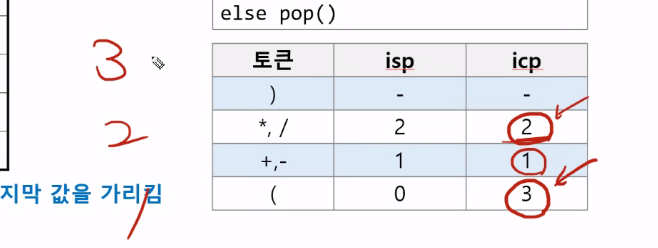


## 계산기 (순서주의)

연산자를 만나면 숫자 두개를 꺼내서 계산하고 다시 결과를 넣음, 

반복..


## 내가 후위표현식을 보고 계산기라고 생각하고 계산하기

*  

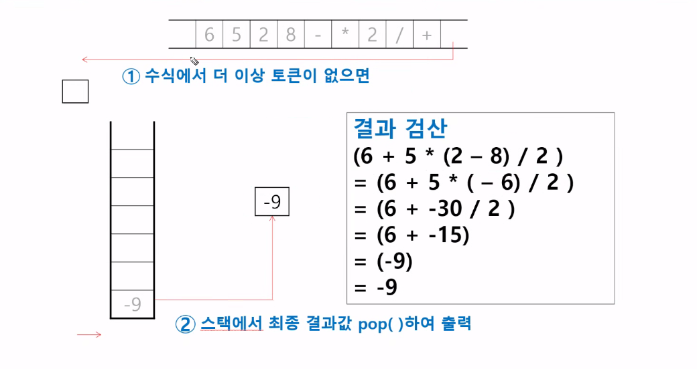


## 백트레킹 (해를 찾는 도중에 막히면 다시 돌아가서 해를 찾는 기법)

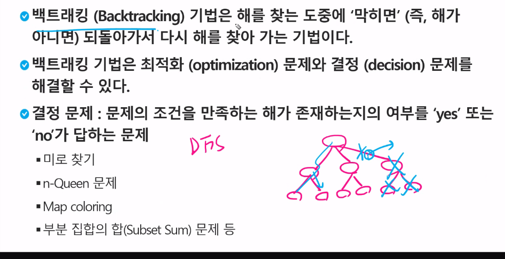

* 1,4   1, 5  1,6, 까지 갔는데 갈때가없으니 다시 pop해서 다 빼주고 1,3이될때 이미 갔던 곳 말고 2,3으로 내려감 

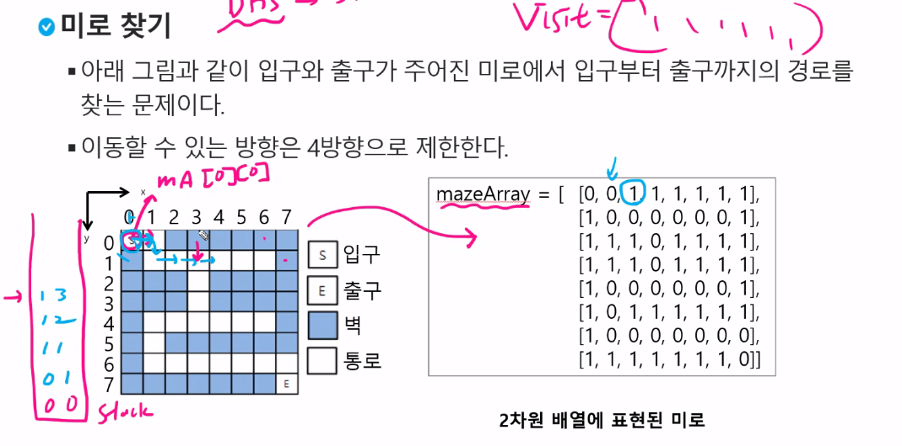


* 백트레킹은 불필요한 경로를 차단한다.
  * DP는 풀이가 백트레킹과 다름, 이전 계산을 가지고 다음 계산을 함
  * 백트레킹은 dfs의 아류느낌, dfs에서 의미없는 길이면 차단해라고 조건문 돌리는 것


* dfs 에서 꼭 해보라고 한 코드? (알려달라하기)

``` python
def powerset(idx, N):

    if idx == N:  # 종료 조건
        print(bit)
        return

    bit[idx] = 1
    powerset(idx + 1, N)

    bit[idx] = 0
    powerset(idx + 1, N)


a = [0, 7, 2, 3]
N = len(a)
bit = [0] * N

powerset(idx=0, N=N)
```


## 상태 공간 트리


## 탐색이 줄어든다


## 연습문제 2번 (1번은 숙제가 아님)

1로 만들고 재귀호출, 0으로 만들고 재귀호출

재귀호출할 때 인덱스를 1증가해서 재귀호출

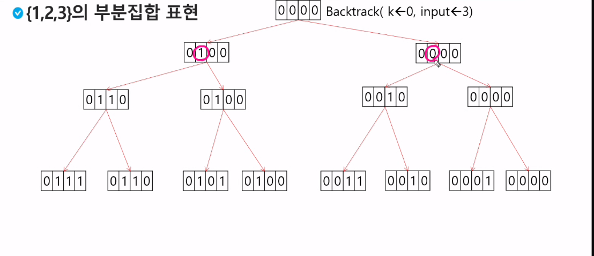


powerset코드

``` python
def powerset(idx, N):

    if idx == N:  # 종료 조건
        print(bit)
        return

    bit[idx] = 1
    powerset(idx + 1, N)

    bit[idx] = 0
    powerset(idx + 1, N)


a = [0, 7, 2, 3]
N = len(a)
bit = [0] * N

powerset(idx=0, N=N)
```


* 깊은 복사 : 1차원일땐 가능한 방법


* 여기서 시작


* 이번 인덱스의 자리를 0으로 만들고 인덱스를 하나 증가시키고

  


* 이번 인덱스의 자리를 1로만들고 또 인덱스 하나를 증가시킴


* 결론 (재귀함수를 이용한 완전탐색, DFS를 이용한 완전탐색 --> )

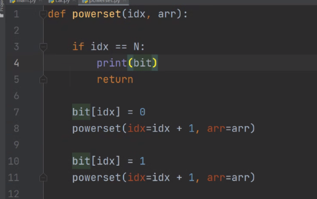

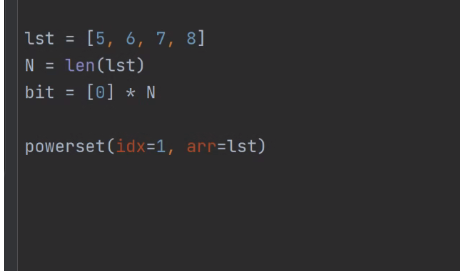

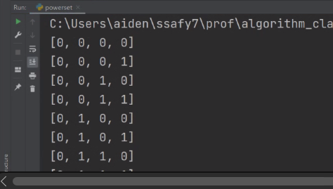


* dfs -> 1번 함수를 스택에 넣고, 
  * 함수의 콜스택 

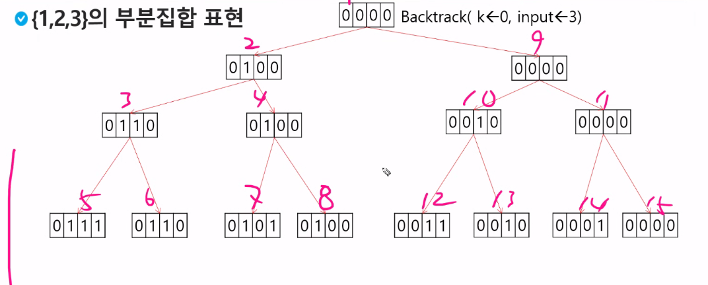


## 부분집합


* 여기서 시작
* bit와 lst의 길이대로 원소별로 묶어줌(zip)
* each는 (1,2) (1,4)이렇게 들어감

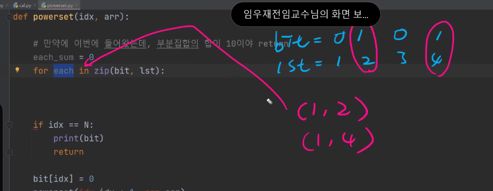


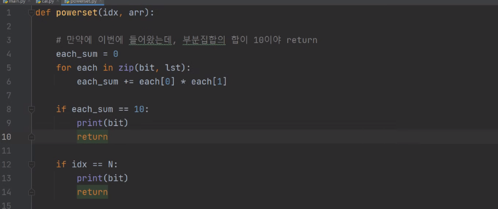


잘짰나 확인해보기


---


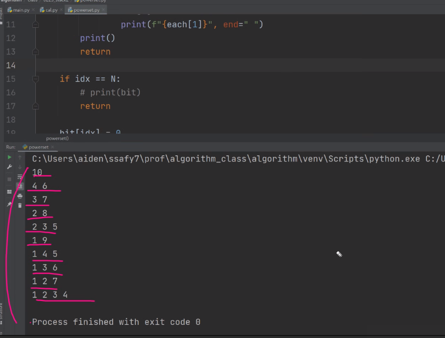


* 부분집합 코드


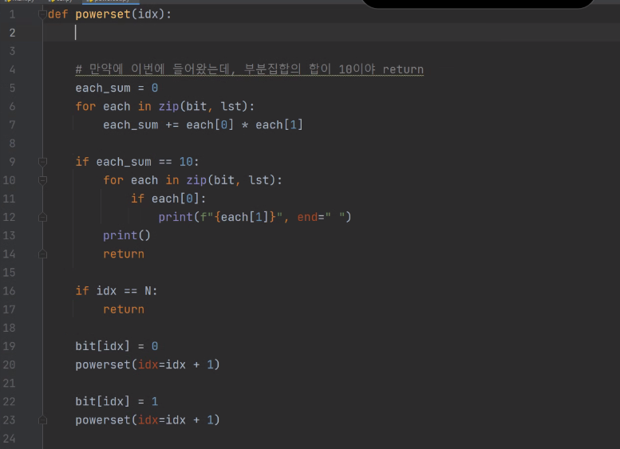


* 12번 코드가 변화함
* 가지치기 코드를 넣으면 연산이 줄어듬 (필요없는 연산)


* 10이될것인데, 굳이 10 이 넘어가면 할필요가 없다.


* 이걸 짤 수 있는가 a형 단골문제 


---

* 순열 조합 (순서가 있는 열) 
  * 

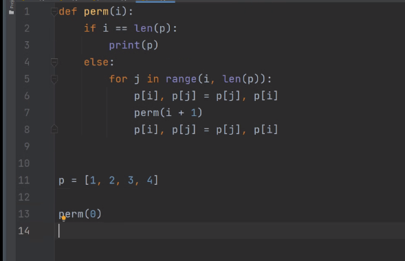

* 함수에서 포문을 돌면서, 순서 바꾸고 재귀호출하고 원래대로 하기 (꼭 기억하기!!!!!!!!!!!) 
  * if문은 종료조건임.
  * 
* 순열


* 순열 구하기

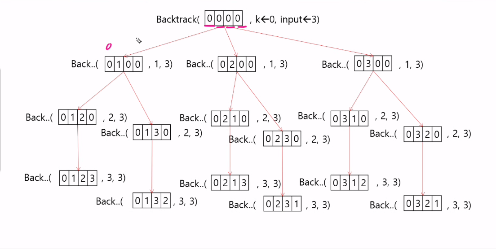

* 


## 퀵소트 (현재는 몰라도됨) cf) 바이너리 서치

* 분할정복알고리즘으로 바이너리 서치의 상위 개념이지만, 지금은 바이너리 서치만 알면됨


* 피봇이 중요하다 (pivot)

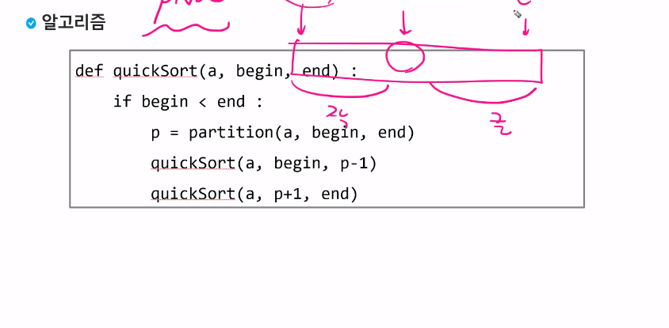


* 피봇을 두고 , 스타트 앤드를 둔다음, 한칸한칸 이동하면서 왼쪽오른쪽을 바꾼다는 개념


* 
* 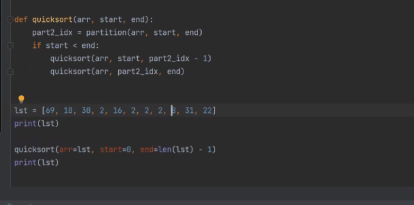


* 파이써닉한 방법

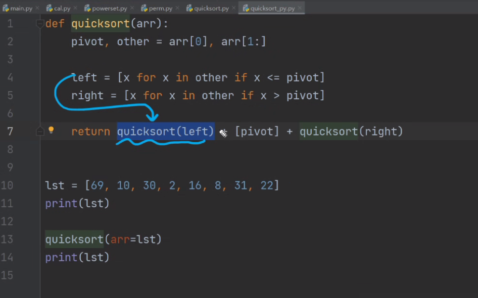

터짐

오류 잡으면

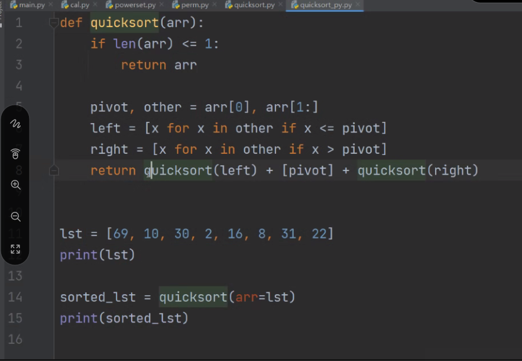


* 파이써닉한 짧은것보다 파티션이 있는 코드가 더 중요함....!!!!!!!!!!!!!!!!!!!!!!


## 어제 유튜브라이브 

* 후위연산으로 어떻게 변경되는가 우리가원하는 결과로 어떻게 변경할 수 있는가?
* 파워셋 , 가지치기
* 퀵정렬

