### 서버

* 존재 이유 : Database

* 서버 :  응답을 해주는 존재

* 우리가 `django만 사용했다면 html` 응답을 했다면,

  `drf를 사용했을 땐 json`으로 응답을 해줌


### 클라이언트

* 서버에게 서비스를 요청하고 필요한 인자를 서버가 요구하는 방식에 맞게 제공
* url을 알아들을 수 있게, 형식에 맞는 요청을 보내기

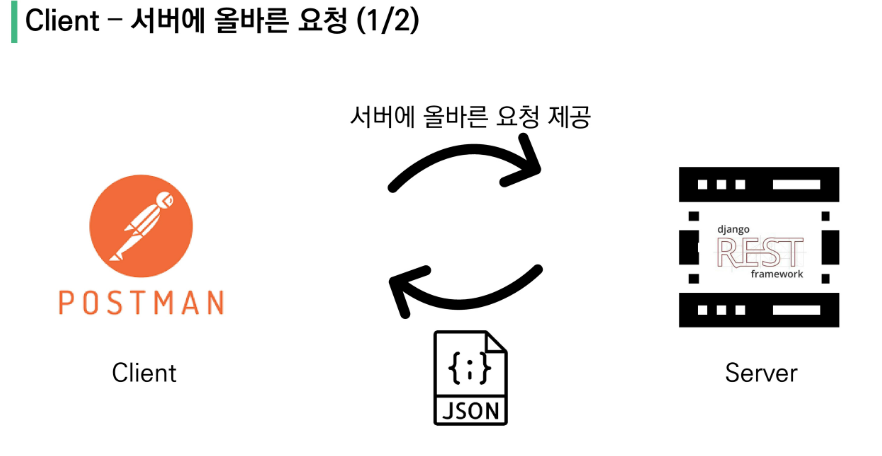

---

### 프로젝트

``` bash
$ python -m venv venv

$ source venv/Scripts/activate

$ pip install django==3.2.12 djangorestframework django_extensions

$ pip freeze > requirements.txt

$ django-admin startproject django_back .

$ touch .gitignore
```

* gitignoreio사이트 접속 `https://www.toptal.com/developers/gitignore` 파일 저장 (=window까지)


https://www.toptal.com/developers/gitignore/api/django,venv,visualstudiocode,python

``` bash
$ git init

$ git add .

$ git commit -m "Init django project"

# branch 확인 
$ git branch

# git branch `브랜치이름`
$ git branch backend

# backend 브랜치로 이동 (backend)
$ git checkout backend
```


---

``` bash
$ python manage.py startapp accounts

$ python manage.py startapp articles	
```


#### 세팅해주기

* `settings.py` 

[1] INSTALLED_APPS


[2] 내장 유저말고 커스텀 유저로 만들 것 `AUTH_USER_MODEL = 'accounts.user'`


accounts app 안에 user 모델이 전체 프로젝트의 user이다.


#### models.py

* `accounts > models.py`

[1] 바로 user를 지정해준다.

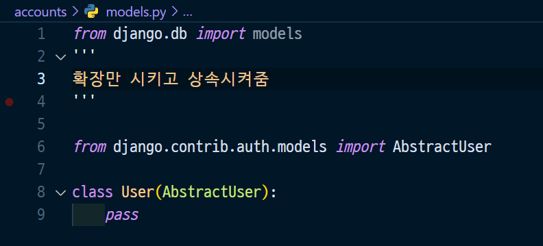


* `article > models.py` 도 써준다.

[1] Article, Comment 모델 정의


---

[2] 각 model끼리 각각 1 대 N 관계를 가짐


[3] 관계를 생각하면서 `article > models.py `완성


#### urls.py

[1] `project의 url 정의`

* path 첫번째인자는 '`회사명 or project명`/v1(버전)/앱이름/' 으로도 사용한다.

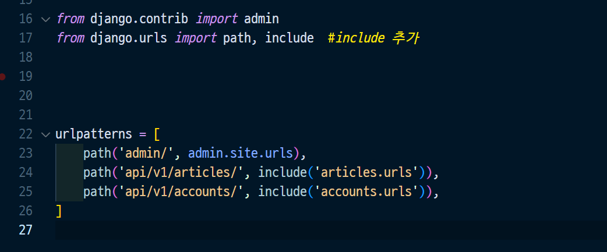


[2] `app의 url정의` - 서버 구동을 위해 최소한을 적어놓는다


---

#### makemigrations, migrate, createsuperuser

``` bash
$ python manage.py makemigrations

$ python manage.py migrate

$ python manage.py createsuperuser
```


#### serializer


* model : 어떤 데이터를 CRUD할지 담당
* serializer : 클라에 어떤 데이터를 구성해서 줄지 선택 (JSON 표현 + Validation 검증 담당) 

* 중앙에 model 이 있고, 

  데이터를 들어올 때 : serializer가 먼저 필터링, validation도 해주고, 

  데이터를 잘 만들어서 내보낼 때 : JSON(key, value값)을 결정하는 역할

  

[1] ❗코드 양이 많아지면 serializers라는 폴더를 만들어서 하위에 파일로 분리 (파일명은 자유)


[2] `articles > serializers > article.py`

* 단일 Article JSON 

  * model serializers에 작성할 것들을 미리 사전에 생각해서 기획하고, 정리가 끝났어야함❗

  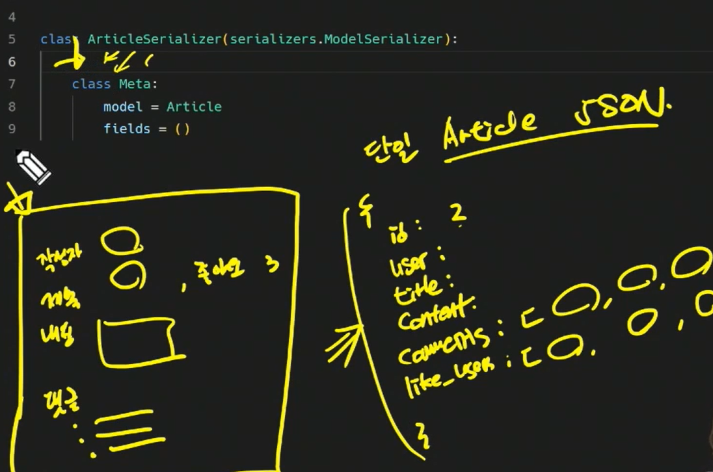


* 이대로만 하게된다면, db에서 번호로 가져와지고, 그 번호만으로는 값을 알 수 없기 때문에 재요청, 재요청을 보내게 된다. 그러면 번거로워지니까 serializer를 확장해야 한다.


[3] `articles > serializers > article.py`


---

### ❗CORS (Same-Origin Policy) : ❗교차 출처 리소스 공유 정책 (상식)

<-> SOP (Single-Origin Policy)

* 특정 출처(origin)에서 불러온 문서나 스크립트가 다른 출처에서 가져온 리소스와 상호작용하는 것을 제한하는 보안 방식
* 잠재적으로 해로울 수 있는 문서를 분리함으로써 공격받을 수 있는 경로를 줄임
*  `브라우저`가 제한함


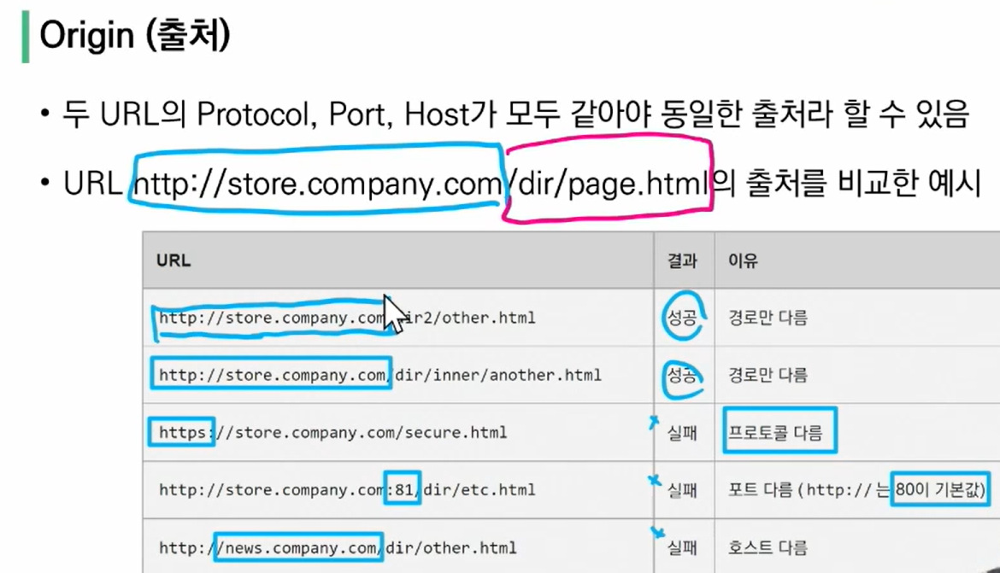

* 파란색이 같아야함

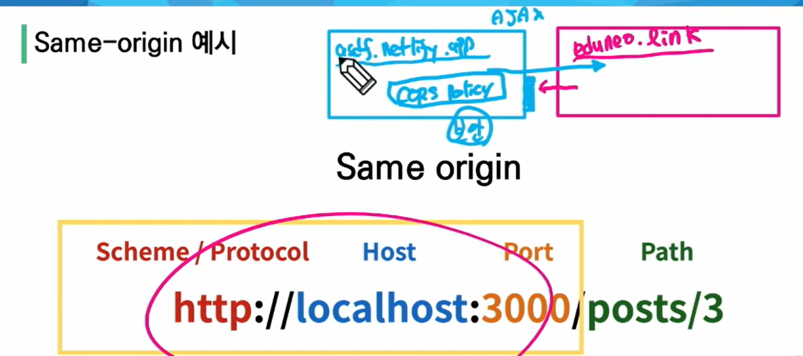

* 요청도 가고 응답도 가지만, 브라우저가 응답을 받지 않음


* 클라이언트에서 브라우저 정책을 사용해서 막는 것이지만

  서버측에서, 응답을 반환할 때 해결해야함 (올바른 CORS header를 포함한 응답을 반환)


> 해결책
>
> 1. Access-Control-Allow-Origin
>
> 2. django 라이브러리 : django-cors-headers


#### 설치 

``` bash
$ pip install django-cors-headers
```


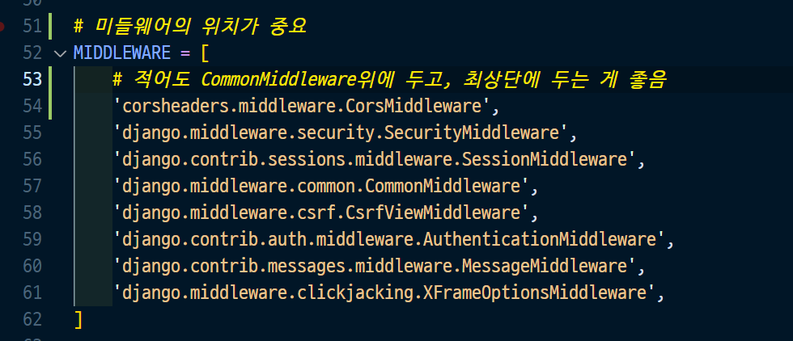

* 위치는 아무데나 작성

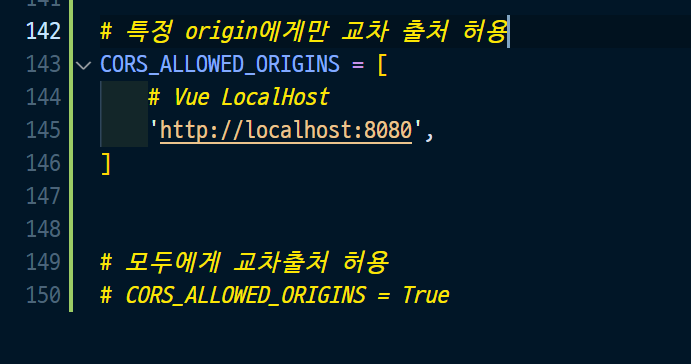

``` 
브라우저 F12에서 fetch('주소')로 시도해보기
```


* 이종간 어플리케이션끼리 왔다갔다 할 때 필수, 포스트맨은 그런 정책이 없고 그냥 띄워준 것


## Authentication(인증) & Authorization

* Authentication
  * 누군지 확인 = 사원증 그자체

* Authorization
  * 권한 부여, 허가 = 부장만 갈 수 있는, 사원만 갈 수 있는 
  * 권한 부여는 항상 인증을 따라야 함
  * 403 Forbidden은 서버가 클라이언트가 누구인지 알고 있음 (401은 모름)


### 다양한 인증 방식

 


### Token Authentication 과정


* 클라이언트에서 서버로 username, password를 json(key, value값)으로 넘김

* 서버에서 accounts_user table에서 ssafy, ssafy123을 찾는데, 

  accounts_user table에는 그대로 저장되어있는게 아니라 엄청 긴 값이 저장되어 있음

* 최종적으로 해싱된 값과 대조해서 서로 같다면,

  새로운 테이블 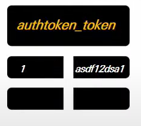을 만듦

* 1번 유저 / 토큰값을 생성하고 토큰값에 매핑해서 유저가 몇번인지도 저장해놓음

* 서버는 클라이언트에 최종적으로 token을 줌 

* 클라이언트는 토큰값을 저장함 

* 요청 헤더에 Token `토큰값`을 보냄 

* 결론 (올바르게 요청 보내고, token을 주기, 클라이언트가 token을 잘 들고 있기, request header에 토큰과 함께 요청하기)


### JWT

 

### dj-rest-auth & django-allauth 라이브러리


* 설치

``` bash
$ pip install django-allauth

$ pip install dj-rest-auth
```


### 소셜로그인하기위한 allauth넣어주기

dj rest auth docs

* https://dj-rest-auth.readthedocs.io/en/latest/installation.html

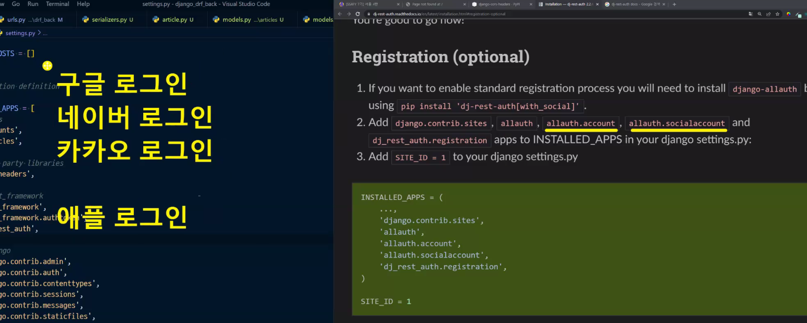


* `SITE_ID` 옵션 주기 (allauth쓰려면 contrib.sites를 써야하고 이걸 쓰려면 SITE_ID를 넣어야함)

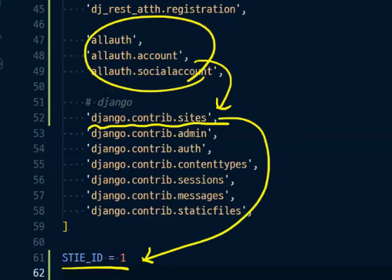


* allauth도 넣기

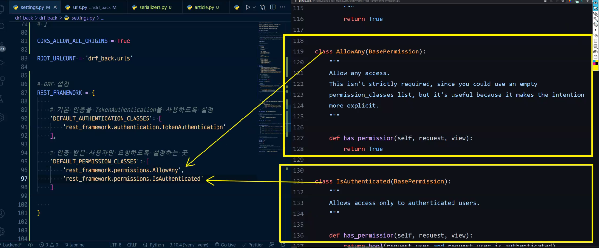

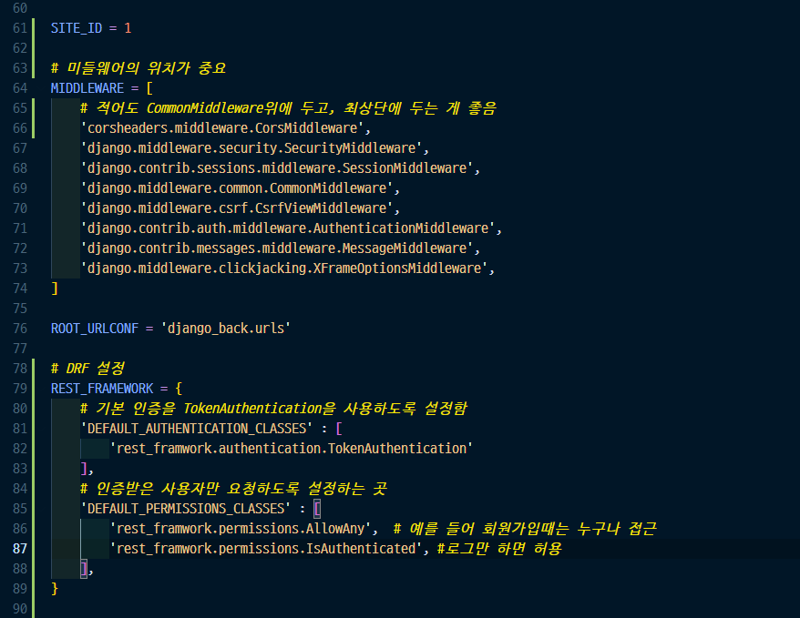


* 프로젝트 `urls.py` 에 코드 넣기 
  * 순서 주의


* 서버를 키면 `dj_rest_auth.urls`가 3~8까지를 사용할 수 있게 해줌 (필요한 것만 가져다 쓰기)


* 


### accounts/urls.py


### accounts/views.py

`serializer는 user를 요청하면 json으로 반환해주고 그걸 view에서 보여주는 것`

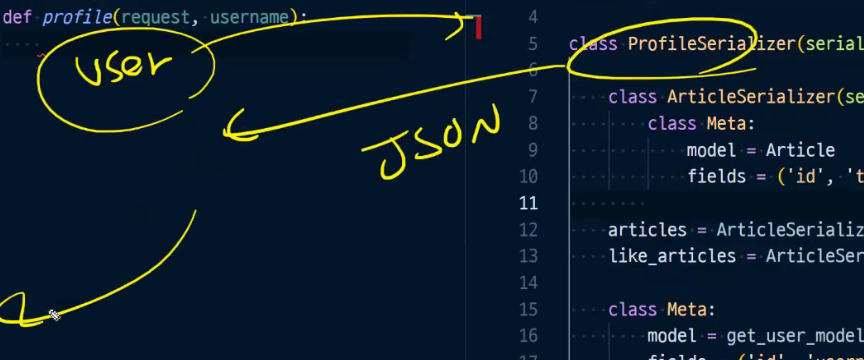

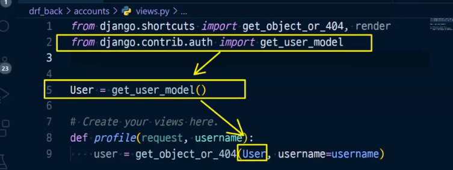


* 모든 필드가 읽기전용이라 `@api_view(['GET'])` 넣어주기

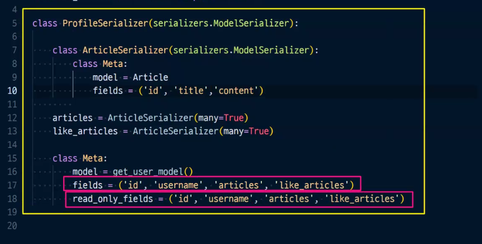


----


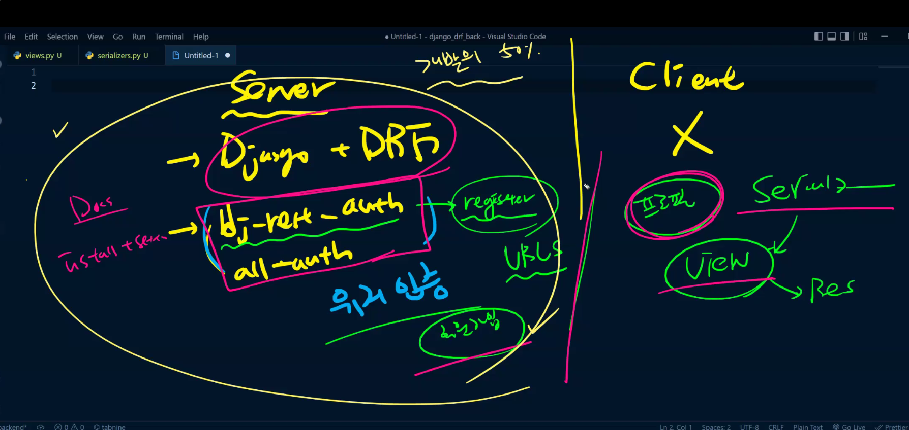

---

### postman 에서 api확인


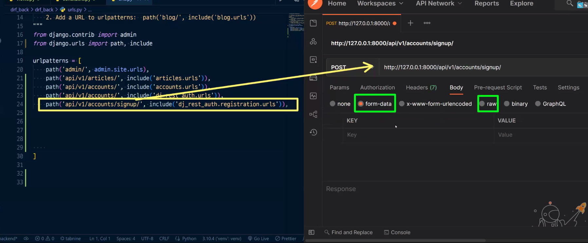


### cf) 토큰 베이스 인증 :  `요즘 토큰에는 만료시간, id를 담고 암호화함`

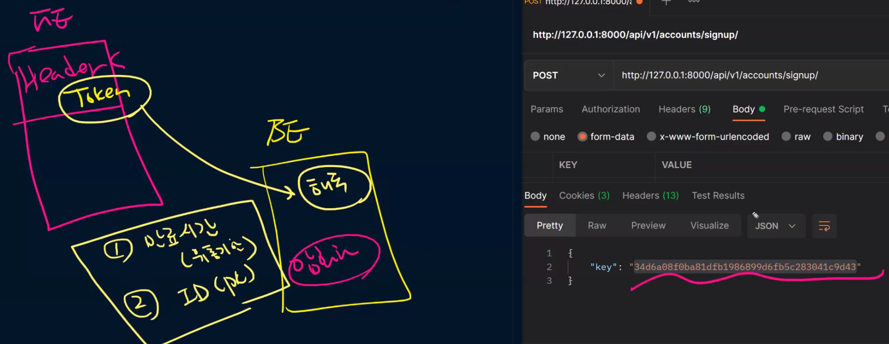

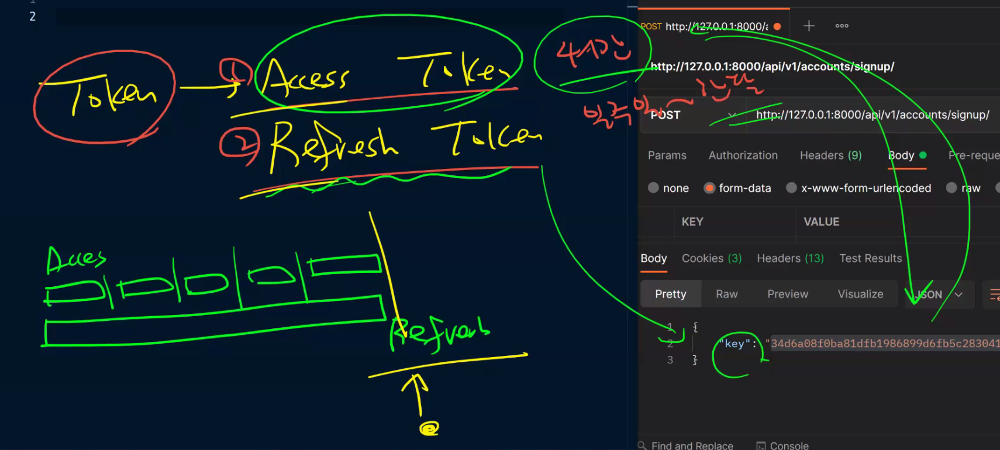
